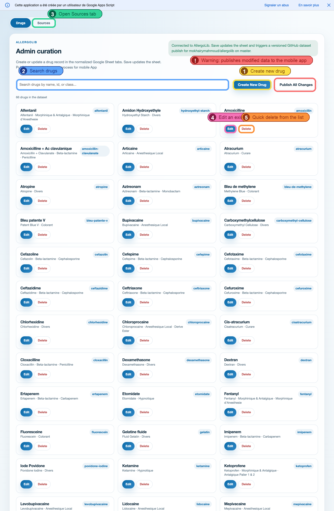
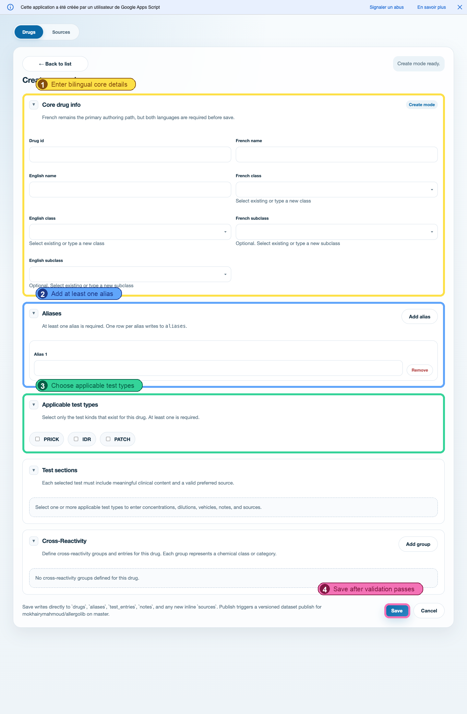
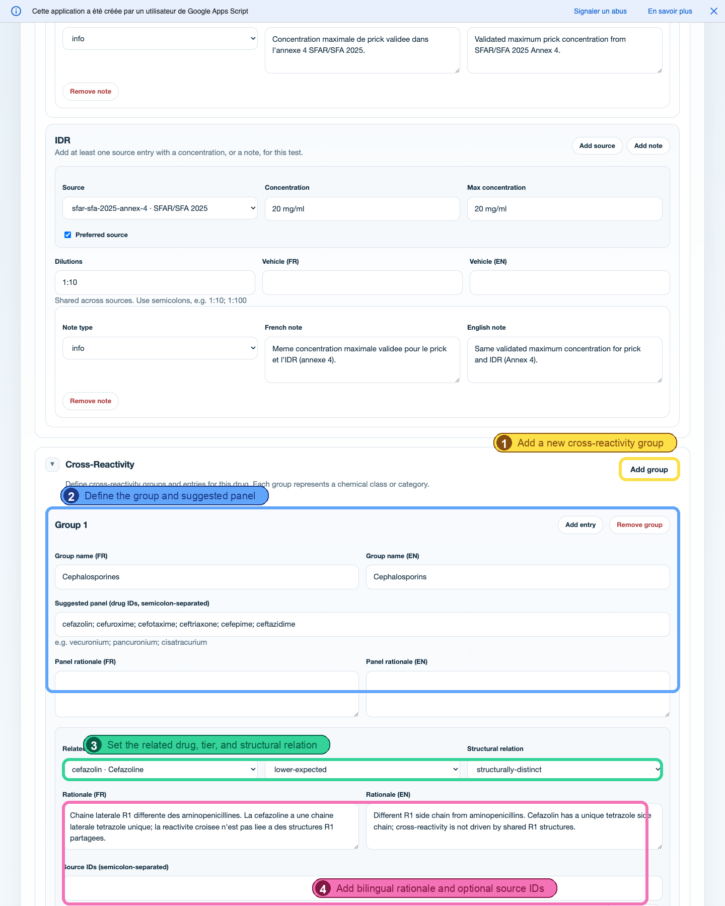
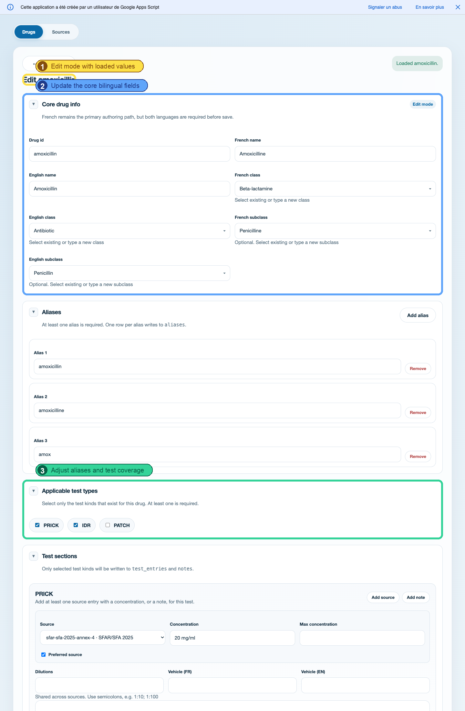
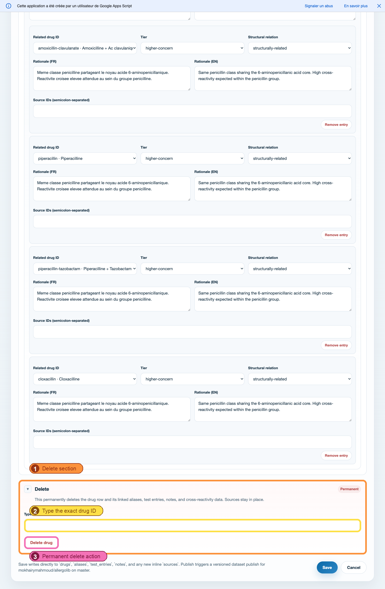
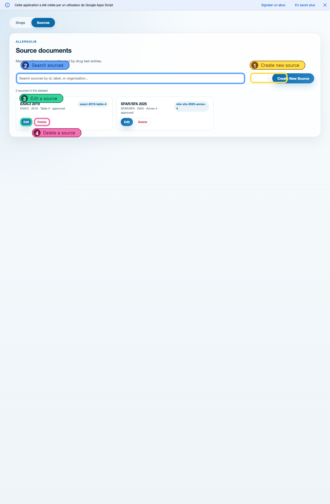
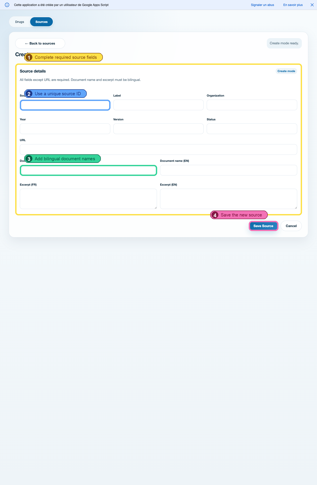

# Admin UI Tutorial

This guide is for admin users working in the deployed Allergolib curation UI.

Please use this url to access the admin platform: https://script.google.com/macros/s/AKfycbwmAq4UjE028bInmXDZidfqoMZ4pUz6egFLRq3C1BB-0nsmo2cRg8adhs54kCxL60vg/exec 

## 1. Start On The Drugs Tab

Use the `Drugs` tab for daily curation work:

- `1` creates a brand-new drug record
- `2` searches by drug name, id, or class
- `3` switches to the `Sources` tab when you need to add or update a reference document
- `4` opens an existing drug in edit mode
- `5` starts the delete flow directly from the list

The `Publish All Changes` button is also available on this screen. Its behavior is explained in section 7 below.
The red warning callout in the screenshot marks that button because it publishes modified data to the mobile app.

## 2. Add A New Drug

1. Open the `Drugs` tab.
2. Click `Create New Drug`.
3. Fill `Core drug info`.
   Add the drug id, French name, English name, French class, and English class.
   If you use a subclass, fill both French and English subclass fields.
4. Add at least one alias in `Aliases`.
5. In `Applicable test types`, select only the tests that exist for this drug.
6. Complete the test sections that appear below.
   Each selected test needs meaningful content and exactly one preferred source.
7. Click `Save`.

In the create form screenshot:

- `1` is the bilingual core section
- `2` is the alias section
- `3` is where you choose the applicable tests
- `4` is the final save action

## 3. Use The Cross-Reactivity Section

Use `Cross-Reactivity` to document known or suspected relationships between the current drug and other drugs.

What to enter:

1. Click `Add group` to create a cross-reactivity group.
   A group is usually a drug family or category such as cephalosporins or penicillins.
2. Fill `Group name (FR)` and `Group name (EN)`.
3. Fill `Suggested panel` with semicolon-separated drug ids when you want to suggest a testing panel.
4. Add `Panel rationale (FR)` and `Panel rationale (EN)` if you want to explain the suggested panel.
5. Click `Add entry` inside the group for each related drug.
6. For each entry, choose:
   `Related drug ID`, `Tier`, and `Structural relation`.
7. Add bilingual rationale for each entry.
8. Add `Source IDs` when the relationship is supported by specific source documents.

Available classification values:

- `Tier`: `higher-concern`, `lower-expected`, or `uncertain`
- `Structural relation`: `structurally-related` or `structurally-distinct`

Validation rules:

- Every group name must be bilingual.
- If panel rationale is provided, it must be bilingual.
- Every group must contain at least one entry.
- Every entry must reference an existing drug id.
- Every entry must have a valid tier and structural relation.
- Every entry rationale must be bilingual.

In the cross-reactivity screenshot:

- `1` adds a new group
- `2` defines the group and optional suggested panel
- `3` sets the related drug, tier, and structural relation
- `4` adds the bilingual rationale and optional source ids

## 4. Modify An Existing Drug

1. Find the drug from the `Drugs` tab.
   Use the search box if needed.
2. Click `Edit`.
3. Update the same sections used during creation:
   core details, aliases, applicable tests, test content, and cross-reactivity.
4. Click `Save`.

In the edit form screenshot:

- `1` shows that you are in edit mode with an existing record loaded
- `2` highlights the core bilingual fields you can update
- `3` marks the alias and applicable-test area that usually changes during maintenance

## 5. Delete A Drug

Use delete only when you are sure the record should be removed.

1. Open the drug in `Edit` mode.
2. Scroll to the `Delete` section at the bottom of the form.
3. Type the exact current drug id in the confirmation field.
4. Click `Delete drug`.

Important:

- Deleting a drug also removes its linked `aliases`, `test_entries`, `notes`, and `cross-reactivity` rows.
- Existing `sources` are not deleted with the drug.

In the delete screenshot:

- `1` is the permanent delete section
- `2` is the exact-id confirmation field
- `3` is the final delete action

## 6. Add A New Resource / Source

The admin UI calls reference documents `Sources`. Add them before or during curation when a test entry needs a source that does not exist yet.

### 6.1 Open The Sources Catalog

1. From the `Drugs` tab, click `Sources`.
2. Use the list to review existing documents first.
3. Click `Create New Source` if the document is not already present.

In the source list screenshot:

- `1` creates a new source
- `2` searches existing sources
- `3` edits a source
- `4` deletes a source

### 6.2 Create The Source

1. Click `Create New Source`.
2. Fill the required fields:
   `Source id`, `Label`, `Organization`, `Year`, `Version`, and `Status`.
3. Add the `URL` if you have one.
4. Fill both `Document name (FR)` and `Document name (EN)`.
5. Fill both `Excerpt (FR)` and `Excerpt (EN)`.
6. Click `Save Source`.

In the source form screenshot:

- `1` highlights the full source-details section
- `2` is the unique source id field
- `3` marks the bilingual document-name area
- `4` saves the source

After the source is saved, go back to the `Drugs` tab and select it from the source dropdowns inside the relevant test section.

## 7. What `Publish All Changes` Does

`Publish All Changes` does not save form edits to Google Sheets.

Use it only after your data changes have already been saved.

Warning:

- This action publishes the modified dataset to the mobile app workflow.

What it does:

- It manually triggers the configured publish workflow for the mobile app dataset.
- It is intended for publishing the current saved dataset state.

Recommended order:

1. Save your drug or source changes first.
2. Return to the `Drugs` list.
3. Click `Publish All Changes` only when you want to publish the current saved version to the mobile app.
4. Wait for the success or error banner at the top of the page.

Important distinction:

- `Save` writes data to Google Sheets.
- `Publish All Changes` triggers the publish workflow to the mobile app.

## Validation Checklist

Before saving, confirm the following:

- Drug core data is complete in both French and English.
- At least one alias exists.
- At least one applicable test type is selected.
- Each selected test has at least one valid source entry.
- Each selected test has exactly one preferred source.
- If you enter vehicle text or notes, provide both French and English.
- Dilutions use ratios such as `1:10; 1:100`.
- If you use cross-reactivity groups, each group needs a bilingual name and at least one entry.
- If you use cross-reactivity panel rationale or entry rationale, provide both French and English.
- For sources, every field except `URL` is required, and document names and excerpts must be bilingual.
