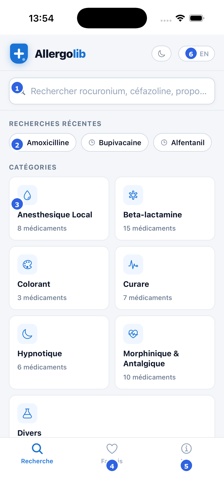
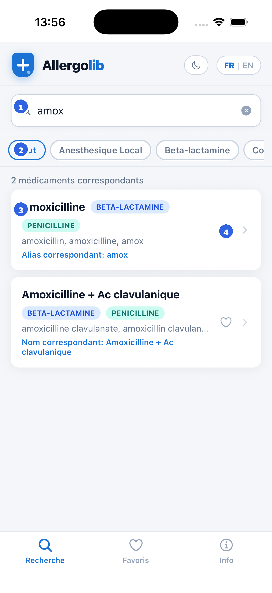
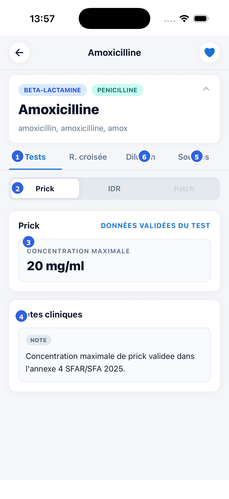
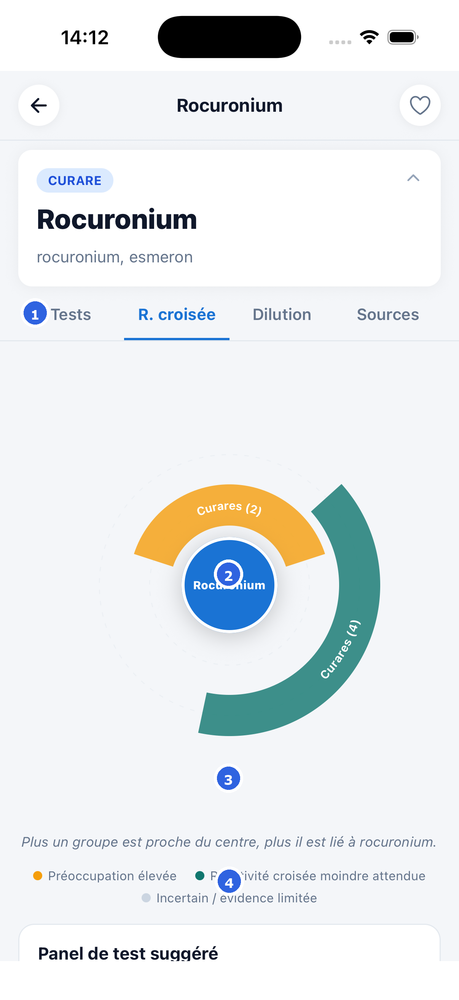
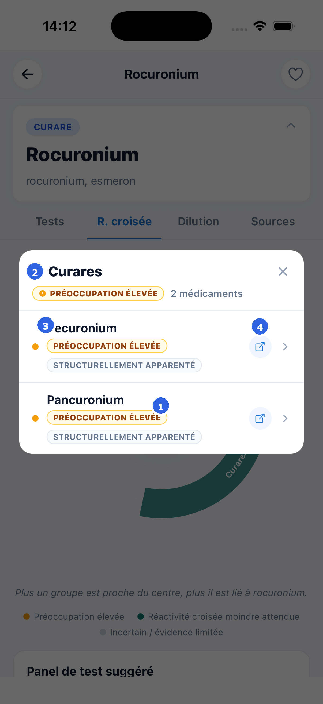
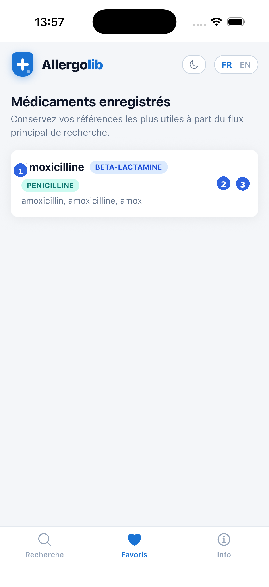
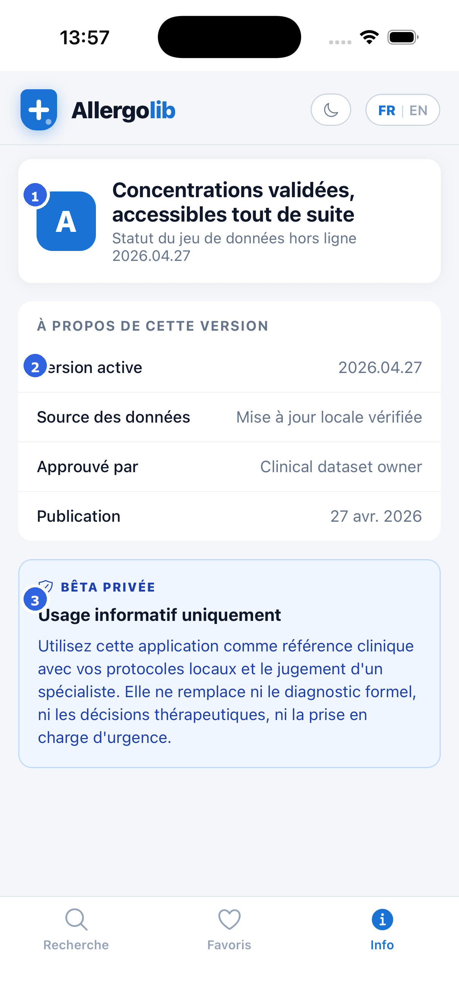

# Allergolib Mobile App Tutorial

This guide explains the main user flows in the mobile app and how to open the current Expo build on a real device.

## 1. Install Expo Go And Open The App

1. Install `Expo Go` from the iOS App Store or Google Play.
2. Scan the `Scan QR Code` and it will redirect you to Expo Go.
3. AllergoLib will open in Expo Go and you can start using it. 

## 2. Home Screen

- `1` Search directly for a drug by name or alias.
- `2` Reopen recent lookups in one tap.
- `3` Browse by category when you want to explore the dataset instead of typing.
- `4` Open the `Favorites` tab to see saved drugs.
- `5` Open the `Info` tab for dataset version and safety information.
- `6` Switch between French and English.

## 3. Search Results

- `1` Enter a drug name, alias, or keyword.
- `2` Narrow the result set with the category chips.
- `3` Tap a drug card to open its testing details.
- `4` Tap the heart icon to save or remove the drug from favorites.

## 4. Drug Detail Screen

- `1` Use the main tabs to move between testing data, cross-reactivity, dilution help, and sources.
- `2` Switch between `Prick`, `IDR`, and `Patch` data for the same drug.
- `3` Read the validated concentration card before testing.
- `4` Review the clinical notes section for context and warnings.
- `5` Open `Sources` to review the supporting reference material.
- `6` Open `Dilution` when you need preparation guidance.

## 5. Cross-Reactivity Ring Diagram

- `1` Open the `R. croisée` tab from the drug detail screen.
- `2` The center circle is the current drug you are reviewing.
- `3` Each colored ring segment is a cross-reactivity group. Rings closer to the center indicate a stronger relationship.
- `4` Use the legend to interpret the colors: higher concern, lower expected cross-reactivity, or uncertain evidence.

When a ring is clicked, the app opens a drill-down list for that group and tier.

- `1` The selected ring stays visible behind the overlay so the user keeps the visual context.
- `2` The overlay header shows which group was opened and how many related drugs are in that tier.
- `3` Each row is a related drug, with its concern level and structural relationship.
- `4` The open icon jumps directly to that drug’s detail page. Tapping the row itself opens the detailed rationale sheet.

## 6. Favorites

- `1` The saved list keeps commonly used drugs easy to reopen.
- `2` Tap the heart to remove a saved drug.
- `3` Tap the row to reopen the full drug detail screen.

## 7. Info And Safety

- `1` The top card shows the current offline dataset version in the app.
- `2` The version block shows release, approval, and publication details.
- `3` The blue compliance panel reminds users that the app is for informational use only.

## 8. Recommended User Flow

1. Open the app in `Expo Go`.
2. Search for a drug or browse by category.
3. Open the drug detail screen.
4. Choose the relevant test type.
5. Review the validated concentration, notes, and sources.
6. If needed, open `R. croisée` to review related drugs.
7. Save frequently used drugs to `Favorites`.
